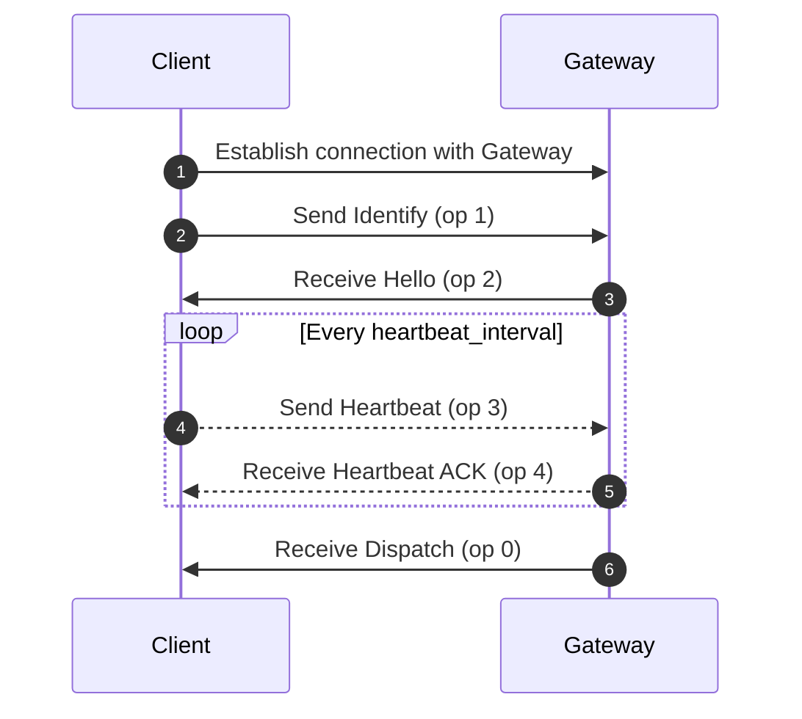

# Gateway

## Endpoints
- `wss://gateway.foxogram.su` - Production
- `wss://gateway.dev.foxogram.su` - Development

## Opcodes (`op`)

- `0` - Dispatch
- `1` - Identify
- `2` - Hello
- `3` - Heartbeat
- `4` - Heartbeat ACK

## Events (`t`)

- `MESSAGE_CREATE`
- `MESSAGE_UPDATE`
- `MESSAGE_DELETE`
- `CHANNEL_CREATE`
- `CHANNEL_UPDATE`
- `CHANNEL_DELETE`
- `MEMBER_ADD`
- `MEMBER_REMOVE`
- `USER_STATUS_UPDATE`
- `USER_UPDATE`
- `CONTACT_ADD`
- `CONTACT_DELETE`
- `TYPING_START`

## Error codes

- `4001` - Unauthorized
- `4002` - Heartbeat Timeout

## Message structure

| Field | Description     |
|-------|-----------------|
| op    | Opcode          |
| d     | Data            |
| s?    | Sequence number |
| t?    | Event name      |

`s` and `t` are null when `op` is not `0` (Dispatch)

**Send**
```json
{
    "op": 2,
    "d": {}
}
```

**Receive**
```json
{
    "op": 0,
    "d": {},
    "s": 42,
    "t": "EVENT_NAME"
}
```

## Examples

### Send events

**Identify**
```json
{
    "op": 1,
    "d": {
        "token": "eyJhbGciOiJIUzI1NiIsInR5cCI6IkpXVCJ9.eyJhIjowfQ.mpOO0N5hjaKrSl8EK16aFxSb_pqOUXVCQLNEt3-JBWg"
    }
}
```

**Heartbeat**
```json
{
    "op": 3
}
```

**Typing start**
```json
{
  "op": 0,
  "d": {
    "channel_id": 1
  }
}
```

### Receive events

**Hello**
```json
{
    "op": 2,
    "d": {
        "heartbeat_interval": 30000
    }
}
```

`heartbeat_interval` value in milliseconds

**Heartbeat ACK**
```json
{
    "op": 4
}
```

**User status update**
```json
{
  "op": 0,
  "d": {
    "user_id": 1,
    "status": 1
  }
}
```

**Typing start**
```json
{
  "op": 0,
  "d": {
    "channel_id": 1,
    "user_id": 1,
    "timestamp": 1748375480000
  }
}
```

**Message create**
```json
{
    "op": 0,
    "d": {},
    "s": 42,
    "t": "MESSAGE_CREATE"
}
```

`d` type of [message](resources/message#message-object) object

## Connection lifecycle


