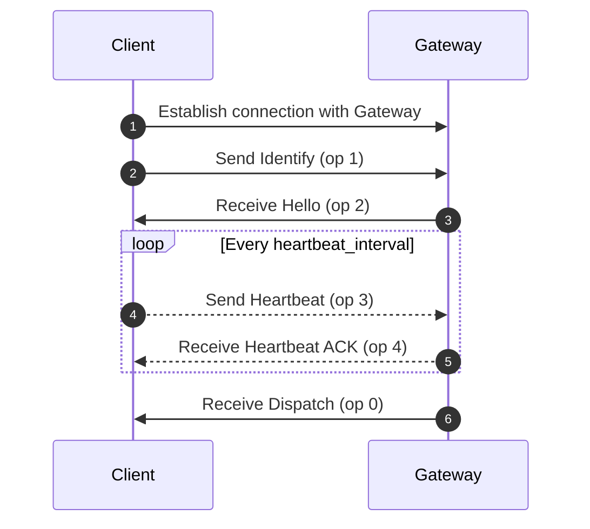

# Gateway

## Endpoints
- `wss://gateway.foxogram.su` - Production
- `wss://gateway.dev.foxogram.su` - Development

## Opcodes (`op`)

- `0` - Dispatch
- `1` - Identify
- `2` - Hello
- `3` - Heartbeat
- `4` - Heartbeat ACK

## Events (`t`)

- `MESSAGE_CREATE`
- `MESSAGE_UPDATE`
- `MESSAGE_DELETE`
- `CHANNEL_CREATE`
- `CHANNEL_UPDATE`
- `CHANNEL_DELETE`
- `MEMBER_ADD`
- `MEMBER_REMOVE`
- `MEMBER_UPDATE`

## Error codes

- `4001` - Unauthorized
- `4002` - Heartbeat Timeout

## Message structure

| Field | Description     |
|-------|-----------------|
| op    | Opcode          |
| d     | Data            |
| s?    | Sequence number |
| t?    | Event name      |

`s` and `t` are null when `op` is not `0` (Dispatch)

**Send**
```json
{
    "op": 2,
    "d": {}
}
```

**Receive**
```json
{
    "op": 0,
    "d": {},
    "s": 42,
    "t": "EVENT_NAME"
}
```

## Send events

**Identify**
```json
{
    "op": 1,
    "d": {
        "token": ""
    }
}
```

## Receive events

**Hello**
```json
{
    "op": 2,
    "d": {
        "heartbeat_interval": 30000
    }
}
```

## Dispatch events

**Message create**
```json
{
    "op": 0,
    "d": {
        // Message object see in docs.foxogram.su
    },
    "s": 0,
    "t": "MESSAGE_CREATE"
}
```

## Connection lifecycle


